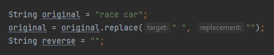
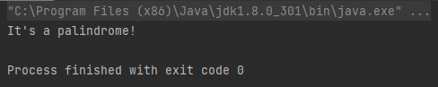

# Java Palindrome Checker

## Description
A Java program without a graphical user interface that checks whether a given string is a palindrome.

## Screenshots

## Table of Contents
 * [Installation](#installation)
 * [Usage](#usage)
 * [Contributing](#contributing)
 * [Questions](#questions)
        
## Installation
Clone this repository and open folder in appropriate IDE.
   
## Usage
Open Main.java, and enter the string you would like to test in `String original`. Run the program to see the answer.

## Contributing
Charity Rogers

## Questions
If you have any questions, please contact me!

  - GitHub: https://github.com/rogerscl116
  - Email: rogerscl116@gmail.com
  
